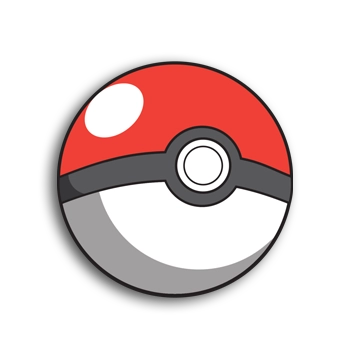

<a id="readme-top"></a>

<!-- PROJECT LOGO -->
<br />
<div align="center">
  <a href="https://github.com/github_username/repo_name">
    
  </a>

<h3 align="center">
Pokemon Battle</h3>

  <p align="center">
    progetto di battaglie Pokemon con integrazione di api
    <br />
    <a href="https://github.com/github_username/repo_name"><strong>Esplora la documentazione »</strong></a>
    <br />
    <br />
  </p>
</div>


<!-- TABLE OF CONTENTS -->
<details>
  <summary>Indice</summary>
  <ol>
    <li>
      <a href="#about-the-project">il progetto in breve</a>
      <ul>
        <li><a href="#built-with">Costruito con </a></li>
      </ul>
    </li>
    <li>
      <a href="#getting-started">Per iniziare</a>
      <ul>
        <li><a href="#prerequisites">Prerequisiti</a></li>
        <li><a href="#installation">Installazione</a></li>
      </ul>
    </li>
    <li><a href="#usage">Uso</a></li>
    <li><a href="#roadmap">Roadmap</a></li>
    <li><a href="#license">Licenza</a></li>
    <li><a href="#contact">Contratto</a></li>
    <li><a href="#acknowledgments">Riconoscimenti</a></li>
  </ol>
</details>


<!-- ABOUT THE PROJECT -->
## Il progetto in breve


Questo progetto è una ricreazione delle battaglie dei vecchi giochi Pokemon con una nuova feature: prendere i dati sui vari Pokemon grazie alle api

<p align="right">(<a href="#readme-top">back to top</a>)</p>


### Costruito con

* [![Visual_Studio][Visual_Studio]][Visual_Studio_url]
* [![FreeCodeCamp][FreeCodeCamp]][FreeCodeCamp-url]
* [![W3school][W3school]][W3school-url]
* ![Windows][Windows]

<p align="right">(<a href="#readme-top">back to top</a>)</p>


<!-- GETTING STARTED -->
## Per Iniziare

1) npm install --save-dev jsdoc
2) npm install --save-dev shx
3) Apri la pagina HTML da browser

### Prerequisiti

Un Desktop che riesce ad aprire un browser

### Installazione

1. Clona la repo
   ```sh
   git clone https://github.com/github_username/repo_name.git
   ```


<p align="right">(<a href="#readme-top">back to top</a>)</p>


<!-- USAGE EXAMPLES -->
## Uso

Giocare. può servire come base per progetti futuri


<p align="right">(<a href="#readme-top">back to top</a>)</p>


<!-- ROADMAP -->
## Roadmap

- [8 gennaio] Demo del gioco
- [14 Gennaio] Sistema Inventario funzionante al 100%
- [25 gennaio ] Gioco funzionante al 100%

<p align="right">(<a href="#readme-top">back to top</a>)</p>


<!-- LICENSE -->
## License

Guardare `LICENSE.txt` per maggiori informazioni.

<p align="right">(<a href="#readme-top">back to top</a>)</p>


<!-- CONTACT -->
## Contatti

- Jerome Colcol - colcol.jerome.07@itisdalmine.edu.it
- Diego Ripamonti - ripamonti.diego.07@itisdalmine.edu.it
- Francesco Daminelli - daminelli.francesco.07@itisdalmine.edu.it

Project Link: [https://github.com/ColcolJerome/TPS-Progetto_API](https://github.com/ColcolJerome/TPS-Progetto_API)

<p align="right">(<a href="#readme-top">back to top</a>)</p>


<!-- ACKNOWLEDGMENTS -->
## Riconoscimenti


<p align="right">(<a href="#readme-top">back to top</a>)</p>


<!-- MARKDOWN LINKS & IMAGES -->
<!-- https://www.markdownguide.org/basic-syntax/#reference-style-links -->
[contributors-shield]: https://img.shields.io/github/contributors/github_username/repo_name.svg?style=for-the-badge
[contributors-url]: https://github.com/github_username/repo_name/graphs/contributors
[forks-shield]: https://img.shields.io/github/forks/github_username/repo_name.svg?style=for-the-badge
[forks-url]: https://github.com/github_username/repo_name/network/members
[stars-shield]: https://img.shields.io/github/stars/github_username/repo_name.svg?style=for-the-badge
[stars-url]: https://github.com/github_username/repo_name/stargazers
[issues-shield]: https://img.shields.io/github/issues/github_username/repo_name.svg?style=for-the-badge
[issues-url]: https://github.com/github_username/repo_name/issues
[license-shield]: https://img.shields.io/github/license/github_username/repo_name.svg?style=for-the-badge
[license-url]: https://github.com/github_username/repo_name/blob/master/LICENSE.txt
[linkedin-shield]: https://img.shields.io/badge/-LinkedIn-black.svg?style=for-the-badge&logo=linkedin&colorB=555
[linkedin-url]: https://linkedin.com/in/linkedin_username
[product-screenshot]: images/screenshot.png
<!-- Shields.io badges. You can a comprehensive list with many more badges at: https://github.com/inttter/md-badges -->
[Next.js]: https://img.shields.io/badge/next.js-000000?style=for-the-badge&logo=nextdotjs&logoColor=white
[Next-url]: https://nextjs.org/
[React.js]: https://img.shields.io/badge/React-20232A?style=for-the-badge&logo=react&logoColor=61DAFB
[React-url]: https://reactjs.org/
[Vue.js]: https://img.shields.io/badge/Vue.js-35495E?style=for-the-badge&logo=vuedotjs&logoColor=4FC08D
[Vue-url]: https://vuejs.org/
[Angular.io]: https://img.shields.io/badge/Angular-DD0031?style=for-the-badge&logo=angular&logoColor=white
[Angular-url]: https://angular.io/
[Svelte.dev]: https://img.shields.io/badge/Svelte-4A4A55?style=for-the-badge&logo=svelte&logoColor=FF3E00
[Svelte-url]: https://svelte.dev/
[Laravel.com]: https://img.shields.io/badge/Laravel-FF2D20?style=for-the-badge&logo=laravel&logoColor=white
[Laravel-url]: https://laravel.com
[Bootstrap.com]: https://img.shields.io/badge/Bootstrap-563D7C?style=for-the-badge&logo=bootstrap&logoColor=white
[Bootstrap-url]: https://getbootstrap.com
[JQuery.com]: https://img.shields.io/badge/jQuery-0769AD?style=for-the-badge&logo=jquery&logoColor=white
[JQuery-url]: https://jquery.com 
[Claude]: https://img.shields.io/badge/Claude-D97757?logo=claude&logoColor=fff
[Claude-url]: https://claude.ai
[Visual_Studio]: https://custom-icon-badges.demolab.com/badge/Visual%20Studio%20Code-0078d7.svg?logo=vsc&logoColor=white
[Visual_Studio_Url]: https://code.visualstudio.com
[FreeCodeCamp]: https://img.shields.io/badge/freeCodeCamp-0A0A23?logo=freecodecamp&logoColor=fff
[FreeCodeCamp-url]: https://www.freecodecamp.org/
[W3school]: https://img.shields.io/badge/W3Schools-04AA6D?logo=w3schools&logoColor=fff
[W3school-url]: https://www.w3schools.com/
[Windows]:https://custom-icon-badges.demolab.com/badge/Windows-0078D6?logo=windows11&logoColor=white
